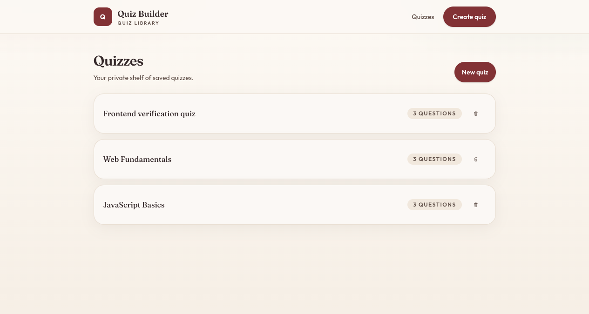
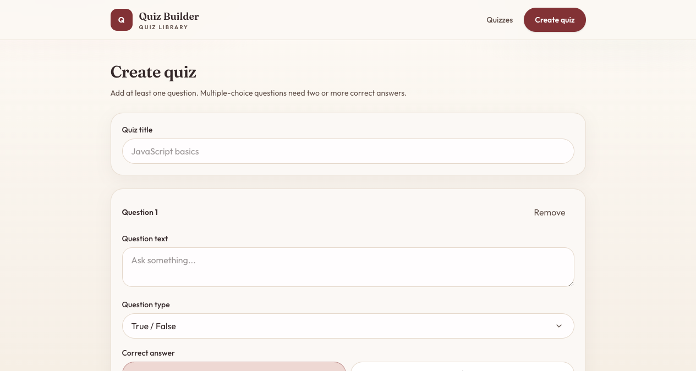
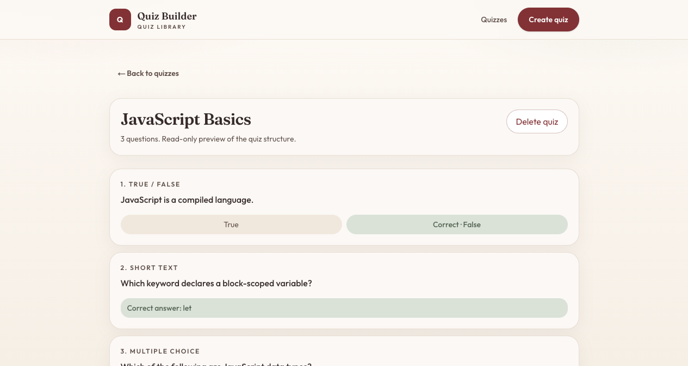

# Quiz Builder

Full-stack quiz creation app: create quizzes, list them, view details, and delete them.

Preview: [https://nadiaturko.github.io/quiz-builder/](https://nadiaturko.github.io/quiz-builder/)

The GitHub Pages demo runs in the browser (quizzes are stored in `localStorage`). The Express + Prisma API is used when you run the app locally.



## Stack

- **Frontend:** React, Next.js, TypeScript, Tailwind CSS, React Hook Form, Zod
- **Backend:** Node.js, Express, TypeScript, Prisma, SQLite, Zod

## Setup

Copy environment files (do not commit `.env` / `.env.local`):

```bash
cp backend/.env.example backend/.env
cp frontend/.env.example frontend/.env.local
```

Backend `.env`:

```
DATABASE_URL="file:./dev.db"
PORT=4000
```

Frontend `.env.local`:

```
API_URL=http://localhost:4000
```

`API_URL` is used only on the Next.js server (BFF and RSC). The browser talks to `/api`, which proxies to Express.

## Set up database

```bash
cd backend
npm install
npx prisma migrate deploy
npx prisma generate
npm run prisma:seed
```

Seed creates sample quizzes (`JavaScript Basics`, `Web Fundamentals`) if the database is empty. To reset existing data:

```bash
FORCE_SEED=1 npm run prisma:seed
```

## Start frontend and backend

Use two terminals.

**Backend** (`http://localhost:4000`):

```bash
cd backend
npm run dev
```

**Frontend** (`http://localhost:3000`):

```bash
cd frontend
npm install
npm run dev
```

Open [http://localhost:3000](http://localhost:3000) — it redirects to `/quizzes`.

## Create a sample quiz

From the UI: [http://localhost:3000/create](http://localhost:3000/create).



Or via API:

```bash
curl -X POST http://localhost:4000/quizzes \
  -H "Content-Type: application/json" \
  -d '{
    "title": "Sample quiz",
    "questions": [
      {
        "text": "TypeScript is a superset of JavaScript.",
        "type": "BOOLEAN",
        "correctAnswer": true
      },
      {
        "text": "What keyword declares a block-scoped variable?",
        "type": "INPUT",
        "correctAnswer": "let"
      },
      {
        "text": "Which are JavaScript data types?",
        "type": "CHECKBOX",
        "options": [
          { "text": "string", "isCorrect": true },
          { "text": "boolean", "isCorrect": true },
          { "text": "html", "isCorrect": false }
        ]
      }
    ]
  }'
```

After creating, open the quiz from `/quizzes`. Details are **read-only**: title, questions, and answer options.



## API

| Method | Path | Description |
| --- | --- | --- |
| `POST` | `/quizzes` | Create a quiz |
| `GET` | `/quizzes` | List quizzes (`id`, `title`, `questionsCount`) |
| `GET` | `/quizzes/:id` | Full quiz with questions and options |
| `DELETE` | `/quizzes/:id` | Delete quiz and related data |

## Pages

| Route | Description |
| --- | --- |
| `/create` | Create a quiz |
| `/quizzes` | List quizzes (with delete) |
| `/quizzes/:id` | Quiz details (read-only structure) |

## Lint and format

```bash
cd frontend && npm run lint && npm run format:check
cd backend && npm run lint && npm run format:check
```
